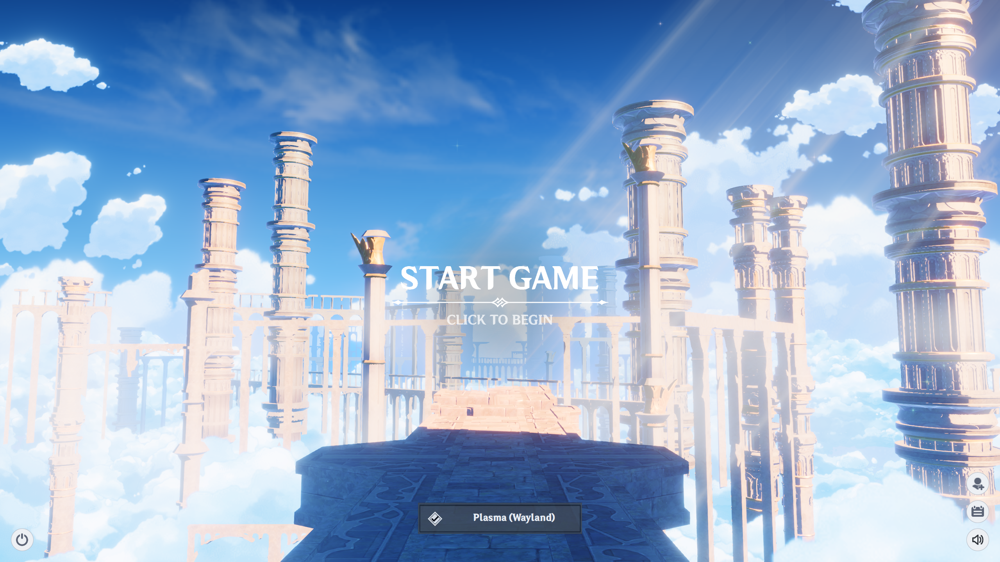

# Genshin Login WebGL — SDDM Theme

A Genshin Impact–inspired 3D login screen for [SDDM](https://github.com/sddm/sddm), built with Qt Quick and an embedded WebGL scene (Three.js). The whole screen is click-driven: nothing appears until you interact with it, and every corner button opens its own animated panel.

<!--
  Add real screenshots here before publishing — none are included yet.
  Suggested shots (see the "What each screenshot should show" section below
  for exactly what to capture):
    screenshots/01-click-to-begin.png
    screenshots/02-door-opening.png
    screenshots/03-login-panel-users.png
    screenshots/04-power-menu.png
    screenshots/05-session-picker.png
    screenshots/06-notices-journal.png
    screenshots/07-caps-lock-warning.png
-->



## How it works

Nothing on screen reacts until you click. This is by design — it mirrors the game's own title screen instead of dumping a login form on you immediately.

1. **Click anywhere** (or the "Conta" button in the corner) — the camera walks toward an ornate door. The first click always plays this entrance sequence; every following click on the corner button just shows or hides the panel instead of replaying it.
2. **The door opens**, with its own sound effect, and the login panel fades in.
3. **The login panel lists your machine's real user accounts** (from SDDM's own user list), each with their real avatar picture when the system has one on file. Clicking an account that has no password configured logs straight in — no password field ever shown for it. Any other account expands into a password field, with a Caps Lock warning that appears automatically while typing.
4. **Corner buttons open the rest of the interface**, each as its own animated panel:
   - **Conta** — the account/login panel described above.
   - **Avisos** (Notices) — a tabbed announcements/journal board, styled after the game's own in-game news feed, with a list on the left and the selected entry's full text on the right.
   - **Selecionar ambiente** (bottom bar) — a real session picker listing every desktop session actually installed on the machine (Plasma, GNOME, etc. — whatever SDDM itself detects), not a hardcoded list.
   - **Power menu** (shutdown / restart / suspend / hibernate) — each action only appears if the system actually supports it, using SDDM's own capability checks (e.g. hibernate is hidden on a machine with no resume-configured swap instead of showing a button that would just fail).
   - **Volume** — mutes/unmutes the background music independently of the ambient scene sound.
5. Background music, UI click sounds, and the door's own opening sound effect play throughout — all toggleable, all routed through Qt Multimedia, not just embedded in the WebGL page.

## Requirements

- SDDM built with QtWebEngine support
- Qt >= 6.5 (Qt Quick, Qt Quick Controls, Qt Multimedia, Qt WebEngine)

## Installation

1. Copy this repository's contents into a theme directory, e.g.:
   ```sh
   sudo cp -r . /usr/share/sddm/themes/genshin-login-webgl
   ```
2. Point SDDM at it, e.g. in `/etc/sddm.conf.d/theme.conf`:
   ```ini
   [Theme]
   Current=genshin-login-webgl
   ```
3. **Important**: this theme's WebGL scene needs a couple of Chromium flags set for the greeter process specifically, or the 3D scene may fail to load under SDDM's restricted system user (a well-known QtWebEngine + sandboxed-user limitation, unrelated to this theme). Add this to the same `sddm.conf.d` file (or your existing `[General]` section):
   ```ini
   [General]
   GreeterEnvironment=QML_XHR_ALLOW_FILE_READ=1,QTWEBENGINE_CHROMIUM_FLAGS=--allow-file-access-from-files --disable-web-security --autoplay-policy=no-user-gesture-required --force-color-profile=srgb --no-sandbox --disable-gpu-sandbox
   ```
4. Restart SDDM (or reboot) to see it.

## Known limitations

- **Audio can go silent on some machines.** If you see "No audio device detected" in `journalctl` right after the greeter starts, this is a Qt Multimedia / PipeWire device-enumeration bug triggered by specific audio hardware (confirmed, in one case, with a USB microphone whose format description Qt's PipeWire backend couldn't parse — which took down detection for every audio device on the system, speakers included). It isn't something this theme's QML code can detect or route around; if you hit it, check `journalctl` for "No audio device detected" / "spaVisitChoice: parse error" near "Using Qt multimedia" at greeter startup, identify whichever audio device is involved, and try removing/disabling it followed by a full reboot (not just a logout — the greeter's own PipeWire session only fully reinitializes on a fresh boot).
- Multi-monitor setups are not specifically handled.

## Credits

The 3D door-opening scene is adapted from an existing Genshin Impact–themed WebGL demo. The SDDM integration layer — the login panel, real system user/session/power support, the notices board, sound bridging, and every interaction described above — was built specifically for this theme.
